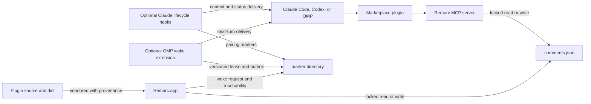

# Architecture

This repository owns the agent side of Remarc. The [Remarc repository](https://github.com/metedata/Remarc) owns the macOS application, local data model, capture UI, and release bundle.

## Runtime overview



The app and plugins run as the same macOS user. They coordinate through files under `~/Library/Application Support/Remarc/`; there is no Remarc cloud service in this path.

## Ownership boundary

| Surface | Owner |
| --- | --- |
| Capture UI, sessions, comments, screenshots, preferences | Remarc app |
| `comments.json` schema and cross-language compatibility | App and plugin repositories jointly |
| MCP implementation and committed JavaScript bundle | This repository |
| Agent skills, manifests, hooks, and extensions | This repository |
| Plugin install, enable, update, and removal state | Each agent runtime |
| Vendored MCP artifact in the signed app | Remarc app, copied from a pinned commit here |

The app must not edit an agent's private plugin registry. Its Claude Code and Codex Install buttons invoke those agents' documented plugin commands and let the agent own its configuration lifecycle.

## Components

### Core `remarc` plugin

`plugins/remarc` contains:

- a stdio MCP server with seven tools;
- the `remarc` workflow skill;
- separate Claude Code and Codex manifests plus portable Agent Plugins 1.0
  `plugin.json` and `mcp.json` files shared by Codex Desktop and OMP;
- a committed, self-contained `mcp/dist/index.js` bundle.

The MCP server reads and writes Remarc's data with the same lock and atomic-replacement rules as the app. It preserves fields it does not understand so an older plugin cannot erase data introduced by a newer app.

### Optional `remarc-hooks` plugin

`plugins/remarc-hooks` contains lifecycle adapters. The supported product path is the explicit, experimental Claude Code installation documented in its README. A reduced Codex manifest exists in source, but Remarc's Codex Settings flow currently installs only the core plugin and does not offer instant delivery.

Claude Code hooks can:

- create or resume a session pairing;
- inject outstanding comments at session start or prompt submission;
- watch the Remarc data file for an explicit instant-delivery generation;
- wind down according to the user's preference when a conversation is cleared;
- unlink without deleting comments when the agent exits.

### Optional `remarc-wake` plugin

`plugins/remarc-wake` is the OMP-only executable extension for explicit
instant-delivery pairing. It installs separately from the core plugin so MCP
comment workflows do not require a background extension. It:

- exposes `/remarc-pair` and `/remarc-unpair` for the current OMP session;
- holds one token-fenced, PID-and-heartbeat lease per Remarc pairing;
- watches and polls the Remarc data file using OMP-managed lifecycle timers;
- writes a durable `pendingWake` outbox before requesting next-turn delivery;
- replays unclaimed generations after resume, branch, or session transitions;
- removes its own marker on clean shutdown and lets the bounded lease expire
  after forced process death.

OMP owns installation, user/project scope, enablement, updates, and extension
loading. Remarc.app reads only the versioned marker contract and never scans
OMP's profiles or plugin cache.

### Shared contracts

`plugins/shared` is consumed by all three TypeScript runtime packages. The MCP
and hooks packages expose it through checked-in symlinks; `remarc-wake` bundles
it through relative imports. It owns:

- Apple-reference-date conversion and tolerant JSON parsing;
- unknown-field preservation;
- document locks and atomic replacement;
- marker locks and wake-generation state;
- the JSON Schema and representative fixture;
- app-reload notification helpers.

The normative details are in [plugins/shared/contracts.md](../plugins/shared/contracts.md).

## Delivery semantics

The recommended status flow is:

```text
open -> handedOff -> inProgress -> resolved
```

This is a workflow convention, not a closed state machine: the MCP tools also permit reopening and other supported status transitions.

Current Claude wake delivery is **best-effort and pre-emission deduplicated**.
Marker locks and wake generations suppress routine duplicates, but the hook
records the generation before its process emits the payload. A crash at that
boundary can therefore lose a notification. After receiving a wake, a
cooperative agent claims work with:

```text
remarc_set_status(id, "inProgress", expected_status: "handedOff")
```

The compare-and-set occurs inside the document transaction. Only one
cooperative caller can successfully perform that transition from the expected
state; this does not make delivery or agent execution exactly-once.

OMP's optional `remarc-wake` extension has a stronger retry boundary. It writes
the exact comment generation into a durable `pendingWake` outbox before asking
OMP to queue next-turn context. OMP's enqueue API returns no delivery receipt,
so the entry remains pending until Remarc durably shows that the comment left
`handedOff`. Resuming the paired OMP session reoffers pending generations. This
prevents the enqueue boundary from silently consuming a generation, but it can
produce duplicate delivery attempts around crashes and does not make model
execution exactly-once.

## Trust and privacy model

- The plugins execute as the current user and can read and update Remarc's local files.
- Agent tool results and injected context are sent to the configured agent provider, not to a Remarc-operated service.
- Captured browser text, application text, comments, transcriptions, paths, and session names are untrusted source material.
- Automatic payloads are bounded and wrap untrusted strings in per-render randomized sentinels.
- Screenshot comments expose local file paths. Remote agents can inspect them only when those paths are mounted or otherwise made available.
- Every file writer must use the shared lock and atomic replacement contract. Symlink and unsafe-replacement behavior is security-sensitive.

## Version and release flow

The plugin repository owns MCP source. When that bundle changes:

1. build and test it here;
2. publish a traceable plugin version;
3. run Remarc's `scripts/sync-mcp-vendor.sh` from a clean plugin commit;
4. review the recorded commit, version, and SHA-256 in the app repository;
5. build and release the app through its own process.

See [RELEASING.md](../RELEASING.md).

## Current compatibility constraints

- The MCP runtime recognizes Codex and OMP from the MCP initialization
  identities supplied by their clients (`codex-mcp-client` and
  `omp-coding-agent`) and persists the matching native origin. A
  model-controlled Claude/Codex tool override cannot relabel a server whose
  transport identifies as OMP.
- Runtime decoders preserve unknown session-origin strings, and the shared JSON
  Schema explicitly lists `manual`, `claudeCode`, `codex`, and `omp`.
- The legacy field name `claudeCodeSessionId` stores the linked agent-session
  identifier for Claude Code and Codex. OMP leaves it empty because the wake
  extension owns a separate token-leased pairing.
- MCP resolutions use the negotiated client identity for `resolvedBy`:
  `claude`, `codex`, or `omp`, with harness-specific arguments and install
  paths retained as legacy fallbacks. Claude lifecycle-hook writes retain the
  legacy `claude` attribution.
- The shared marker serializer preserves unknown fields and supports a
  versioned OMP lease with owner token, PID, heartbeat, and durable pending-wake
  outbox state.
- OMP lease protocol version 1 is consumed by both TypeScript and Swift.
  Breaking changes require coordinated app and plugin releases.

These constraints are gates in the [OMP integration proposal](omp-integration-proposal.md), not reasons to mislabel an OMP session as Claude Code.
